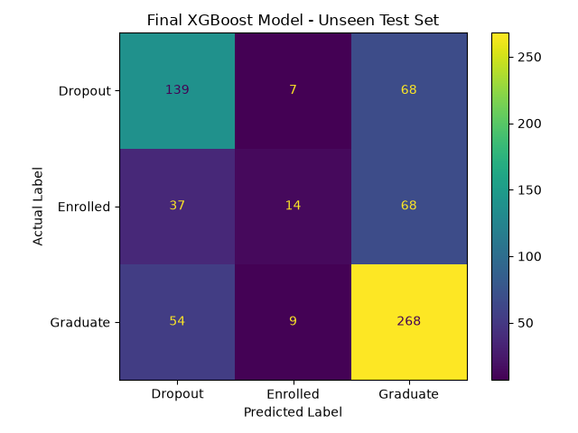

# Student Dropout and Academic Success Prediction

## 📌 Project Overview

This project uses machine learning to predict student academic outcomes based on student demographic, academic, and enrollment-related information.

The model predicts one of three possible outcomes:

- **Dropout**
- **Enrolled**
- **Graduate**

The project compares multiple machine learning models, evaluates their performance, investigates class balancing, performs XGBoost hyperparameter tuning, selects a final model based on validation performance, and evaluates the final model on an unseen test dataset.

The goal of this project is to explore how machine learning can be applied to identify patterns in student data and predict academic outcomes.

---

## 🎯 Objectives

The main objectives of this project are to:

- Explore and preprocess student data for machine learning.
- Build a classification pipeline for predicting student academic outcomes.
- Compare different machine learning algorithms.
- Investigate the impact of class balancing.
- Evaluate models using multiple classification metrics.
- Perform hyperparameter tuning on XGBoost.
- Select a final model based on validation performance.
- Retrain the selected model using the training and validation datasets.
- Evaluate the final model on an unseen test dataset.
- Analyse the strengths and weaknesses of the final model.

---

## 📊 Dataset

The dataset contains **4,424 student records** and **23 features** after feature selection.

The target variable consists of three classes:

| Outcome | Number of Students |
|---|---:|
| Graduate | 2,209 |
| Dropout | 1,421 |
| Enrolled | 794 |
| **Total** | **4,424** |

### Dataset Split

The dataset was divided into three subsets:

| Dataset | Number of Samples | Percentage |
|---|---:|---:|
| Training | 3,096 | 70% |
| Validation | 664 | 15% |
| Testing | 664 | 15% |
| **Total** | **4,424** | **100%** |

The data was split using stratification to preserve the distribution of the target classes across the training, validation, and test datasets.

The **training set** was used to train the machine learning models.

The **validation set** was used to compare models and select the final model.

The **test set** was kept completely unseen during model training and model selection and was used only for the final evaluation.

---

## ⚙️ Data Preprocessing

The preprocessing pipeline separates the features into numerical and categorical variables.

The dataset contains:

- **17 categorical features**
- **6 numerical features**

The following preprocessing techniques were used:

- `StandardScaler` for numerical features.
- `OneHotEncoder` for categorical features.
- `handle_unknown='ignore'` to handle previously unseen categorical values.
- `LabelEncoder` for converting target classes into numerical labels for XGBoost.

The target encoding used for XGBoost was:

```text
Dropout  -> 0
Enrolled -> 1
Graduate -> 2
```

The preprocessing steps were implemented using:

- `ColumnTransformer`
- `Pipeline`

This approach ensures that preprocessing is applied consistently during model training and prediction while helping prevent data leakage between the training, validation, and test datasets.

---

## 🤖 Machine Learning Models

The following machine learning models were implemented and evaluated:

1. Logistic Regression
2. Balanced Logistic Regression
3. Balanced Decision Tree
4. Balanced Random Forest
5. XGBoost
6. Balanced XGBoost
7. Tuned XGBoost

The models were evaluated using:

- Accuracy
- Precision
- Recall
- F1-score
- Macro F1-score

These metrics were used to obtain a more complete understanding of model performance, particularly because the dataset contains an unequal distribution of target classes.

---

## ⚖️ Class Balancing

The dataset contains an unequal number of samples for each target class.

The class distribution is:

- **Graduate:** 2,209
- **Dropout:** 1,421
- **Enrolled:** 794

Because of this imbalance, balanced versions of Logistic Regression, Decision Tree, Random Forest, and XGBoost were investigated.

The purpose of class balancing was to determine whether giving greater importance to less represented classes could improve the model's ability to identify those classes.

The balanced models were compared with their standard counterparts using the same validation dataset.

---

## 📈 Model Comparison

The models were initially evaluated on the validation dataset.

| Model | Validation Accuracy | Macro F1 |
|---|---:|---:|
| Logistic Regression | 60% | 0.50 |
| Balanced Logistic Regression | 55% | 0.52 |
| Balanced Decision Tree | 51% | 0.46 |
| Balanced Random Forest | 55% | 0.48 |
| **XGBoost** | **61%** | **0.51** |
| Balanced XGBoost | 54% | 0.50 |
| Tuned XGBoost | 58% | 0.48 |

Based on the validation results, the **original XGBoost model** was selected as the final model.

Although hyperparameter tuning was performed, the tuned XGBoost model did not outperform the original XGBoost model on the validation set. Therefore, the original XGBoost model was selected for the final evaluation.

---

## 🔧 XGBoost Hyperparameter Tuning

Hyperparameter tuning was performed on the XGBoost model using `RandomizedSearchCV`.

The tuning process used:

- **5-fold Stratified Cross-Validation**
- **30 parameter combinations**
- **150 total model fits**

The best parameters identified during tuning were:

```text
n_estimators = 500
max_depth = 4
learning_rate = 0.1
subsample = 0.7
colsample_bytree = 0.9
```

The best cross-validation Macro F1 score was:

```text
0.5438
```

However, the tuned XGBoost model achieved a validation accuracy of **58%**, while the original XGBoost model achieved **61%**.

Therefore, the original XGBoost model was retained as the final model.

This demonstrates that hyperparameter tuning does not always guarantee improved performance on a separate validation dataset.

---

## 🏆 Final Model

The original **XGBoost model** was selected as the final model based on its validation performance.

After model selection was completed, the training and validation datasets were combined.

The final model was therefore trained using:

**3,760 student records**

The model was then evaluated on:

**664 previously unseen test records**

The test dataset was not used during model training or model selection.

This approach provides a more reliable estimate of how the final model performs on data it has not previously seen.

---

## 📊 Final Test Results

The final XGBoost model achieved an overall test accuracy of:

### **63.4%**

The detailed classification results were:

| Class | Precision | Recall | F1-Score |
|---|---:|---:|---:|
| Dropout | 0.60 | 0.65 | 0.63 |
| Enrolled | 0.47 | 0.12 | 0.19 |
| Graduate | 0.66 | 0.81 | 0.73 |
| **Overall Accuracy** | | | **63.4%** |

---

## 🔍 Results Analysis

The final model performed best when predicting the **Graduate** class.

The model achieved:

- **66% precision**
- **81% recall**
- **73% F1-score**

The recall of **81%** means that the model correctly identified a large proportion of the students who actually belonged to the Graduate class.

The model also performed reasonably well for the **Dropout** class, achieving:

- **60% precision**
- **65% recall**
- **63% F1-score**

However, the model struggled to identify students in the **Enrolled** class.

The model achieved:

- **47% precision**
- **12% recall**
- **19% F1-score**

The low recall for the Enrolled class indicates that the model incorrectly classifies many students who are actually Enrolled as either Dropout or Graduate.

This suggests that distinguishing between students who remain enrolled and those who eventually graduate or drop out is a challenging classification problem using the current features and model.

The results also demonstrate why accuracy should not be considered the only measure of model performance. Although the final model achieved an overall accuracy of **63.4%**, performance varied significantly between the three classes.

---

## 📊 Confusion Matrix

The confusion matrix provides a visual representation of the final model's predictions on the unseen test dataset.

It shows the number of correctly and incorrectly classified students across the three outcome classes:

- Dropout
- Enrolled
- Graduate



---

## 🧠 Key Findings

The main findings from this project are:

- The dataset contains **4,424 student records**.
- The target variable contains three classes: Dropout, Enrolled, and Graduate.
- The dataset has an unequal class distribution.
- Seven machine learning approaches were evaluated.
- XGBoost achieved the highest validation accuracy at **61%** among the evaluated models.
- Class balancing improved the recall of some classes in certain models but did not improve overall validation accuracy.
- Hyperparameter tuning produced a cross-validation Macro F1 score of **0.5438**.
- The tuned XGBoost model did not outperform the original XGBoost model on the validation dataset.
- The original XGBoost model was therefore selected as the final model.
- The final model achieved **63.4% accuracy** on the unseen test dataset.
- The model performed best at identifying Graduate students.
- The Enrolled class was the most difficult class for the model to predict.
- The results demonstrate the importance of evaluating precision, recall, and F1-score in addition to accuracy.

---

## 🚀 Future Improvements

Several improvements could be explored in future versions of the project.

### 1. Improve Enrolled Class Prediction

The biggest limitation of the current model is the low recall for the Enrolled class.

Future work could investigate:

- Alternative class-balancing techniques.
- Different class weights.
- Oversampling methods.
- Undersampling methods.
- Synthetic data generation techniques.
- Threshold adjustment.

### 2. Feature Engineering

Additional feature engineering could be explored to identify relationships between existing variables.

For example:

- Creating meaningful combinations of existing features.
- Transforming skewed numerical features.
- Identifying highly correlated variables.
- Removing irrelevant features.

### 3. Model Explainability

Future versions could use explainability techniques such as **SHAP** to investigate which features contribute most to the model's predictions.

This could help answer questions such as:

- Which factors are associated with student dropout?
- Which features are most important for predicting graduation?
- Why does the model classify a particular student as Dropout or Graduate?

### 4. Additional Machine Learning Models

Other classification algorithms could be investigated, including:

- Support Vector Machines.
- K-Nearest Neighbors.
- LightGBM.
- CatBoost.
- Neural Networks.

### 5. Further Hyperparameter Optimization

A larger hyperparameter search could be performed using:

- `GridSearchCV`
- `RandomizedSearchCV`
- Bayesian optimization
- Optuna

---

## 🛠️ Technologies Used

- **Python**
- **Pandas**
- **NumPy**
- **Scikit-learn**
- **XGBoost**
- **Matplotlib**
- **UCI Machine Learning Repository**

---

## 📦 Installation

Clone the repository:

```bash
git clone https://github.com/tebatsoSophy/student-outcome-prediction.git
```

Navigate to the project directory:

```bash
cd student-outcome-prediction
```

Install the required dependencies:

```bash
pip install -r requirements.txt
```

---

## ▶️ How to Run the Project

Run the main Python script:

```bash
python main.py
```

The program will:

1. Load the dataset.
2. Select the required features.
3. Separate numerical and categorical variables.
4. Preprocess the data.
5. Split the dataset into training, validation, and test sets.
6. Train multiple machine learning models.
7. Evaluate the models using the validation dataset.
8. Investigate class-balanced models.
9. Perform XGBoost hyperparameter tuning.
10. Compare the tuned model with the original XGBoost model.
11. Select the final model.
12. Combine the training and validation datasets.
13. Retrain the final model.
14. Evaluate the final model on the unseen test dataset.
15. Generate the final classification report.
16. Display the confusion matrix.

---

## 📁 Project Structure

```text
Student-Pre/
│
├── main.py
├── README.md
├── requirements.txt
│
└── results/
    └── confusion_matrix.png
```

---

## 📌 Project Workflow

```text
Dataset
   │
   ▼
Feature Selection
   │
   ▼
Data Preprocessing
   │
   ├── Numerical Features
   │       │
   │       ▼
   │   StandardScaler
   │
   └── Categorical Features
           │
           ▼
       OneHotEncoder
   │
   ▼
Train / Validation / Test Split
   │
   ▼
Model Training
   │
   ├── Logistic Regression
   ├── Balanced Logistic Regression
   ├── Decision Tree
   ├── Random Forest
   ├── XGBoost
   └── Balanced XGBoost
   │
   ▼
Model Comparison
   │
   ▼
XGBoost Hyperparameter Tuning
   │
   ▼
Final Model Selection
   │
   ▼
Train + Validation Data Combined
   │
   ▼
Final XGBoost Training
   │
   ▼
Unseen Test Data
   │
   ▼
Final Evaluation
   │
   ├── Accuracy
   ├── Precision
   ├── Recall
   ├── F1-Score
   └── Confusion Matrix
```

---

## 👩🏽‍💻 Author

**Tebatso Mahlathini**

Computer Science Honours Student  
University of Pretoria

---

## 📌 Project Status

**Completed — Initial Machine Learning Model**

The current version implements an end-to-end machine learning workflow, including data preprocessing, model comparison, class balancing experiments, XGBoost hyperparameter tuning, final model selection, and evaluation on an unseen test dataset.

Future improvements will focus on improving the prediction of the **Enrolled** class, exploring feature engineering and model explainability, and investigating additional machine learning algorithms.

---

## 📄 License

This project is intended for educational and portfolio purposes.
